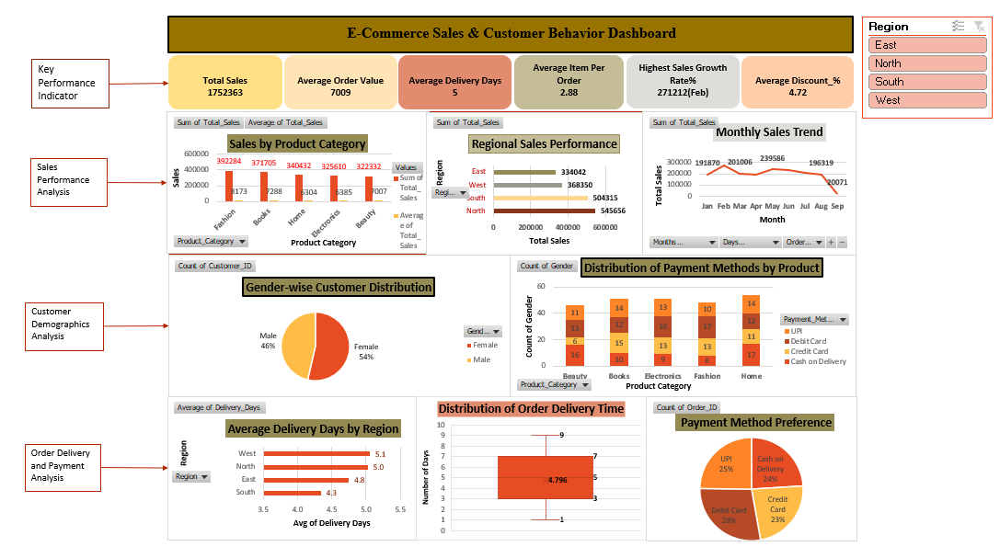

# ecommerce-sales-analysis-excel
E-commerce Sales Analysis and Interactive Dashboard using Microsoft Excel
# E-Commerce Sales & Customer Behavior Analysis using Excel

## Project Overview

This project focuses on analyzing **E-Commerce transaction data using Microsoft Excel** to understand sales performance, customer behavior, delivery efficiency, and payment preferences.

The project follows an end-to-end data analysis workflow, starting with **data cleaning and preparation**, followed by sales and customer analysis, statistical analysis, and finally the development of an **interactive Excel dashboard**.

The analysis demonstrates how Excel can be used to transform raw transactional data into meaningful business insights that support **data-driven decision-making**.

---

## Business Objectives

The project is divided into four major analytical objectives:

1. **Data Cleaning and Preparation**
2. **Sales Performance Analysis**
3. **Customer Demographic Analysis**
4. **Order Delivery and Payment Analysis**

---

## Dataset Overview

The dataset represents realistic E-Commerce transaction data designed to analyze customer behavior, sales performance, delivery efficiency, and payment trends.

### Dataset Characteristics

| Attribute | Details                    |
| --------- | -------------------------- |
| Records   | 255                        |
| Columns   | 13                         |
| Tool      | Microsoft Excel            |
| Data Type | Integer, Float, Date, Text |

### Key Variables

* `Order_ID`
* `Order_Date`
* `Customer_ID`
* `Gender`
* `Age`
* `Region`
* `Product_Category`
* `Payment_Method`
* `Quantity`
* `Unit_Price`
* `Discount_%`
* `Delivery_Days`
* `Total_Sales`

## The dataset covers product categories including **Electronics, Fashion, Home, Beauty, and Books**, along with customer, sales, payment, and delivery-related information.

## Data Cleaning & Preparation

Data cleaning was performed before the analysis to improve the accuracy and reliability of the results.

### Cleaning activities included:

* Identifying missing values in the `Discount_%` column
* Replacing missing discount values with `0`
* Identifying and removing duplicate `Order_ID` records
* Standardizing date and numerical formats
* Validating the calculated `Total_Sales` column
* Checking calculation accuracy using Excel formulas

Excel **Filters, Find & Replace, IF functions, Remove Duplicates, and formulas** were used during the preparation process.

---

## Sales Performance Analysis

The sales analysis focused on understanding product-category performance, regional performance, and sales trends.

### Analysis Performed

* Identified top-performing product categories
* Identified low-performing regions
* Analyzed monthly sales trends
* Calculated mean and median of total sales
* Compared total and average sales across categories and regions

### Excel Techniques

* PivotTables
* Sum and Average aggregations
* Clustered Column Charts
* Bar Charts
* Line Charts

### Key Findings

* **Electronics and Fashion** contribute the highest sales, indicating strong customer demand.
* The **South region** records the highest sales and represents the strongest market.
* Sales show notable increases during **February and May**, indicating seasonal demand peaks.

---

## Customer Demographic Analysis

Customer demographics were analyzed to understand customer distribution and payment behavior across different product categories.

### Analysis Performed

* Gender-wise customer distribution
* Payment method distribution across product categories
* Comparison of customer and sales patterns

### Key Findings

* **Female customers represent 54%** of the customer base.
* **Male customers represent 46%** of the customer base.
* **UPI and Debit Cards** are consistently preferred across most product categories.
* **Cash on Delivery** remains relevant, particularly for Fashion and Home categories.

---

## Order Delivery & Payment Analysis

The project also examined operational performance through delivery time and payment preferences.

### Analysis Performed

* Average delivery time by region
* Delivery-time variation
* Range and standard deviation
* Overall payment method preference

### Key Findings

* The **South region has the lowest average delivery time**, indicating strong logistics performance.
* Most orders are delivered within approximately **3–7 days**, showing relatively consistent delivery performance.
* **Debit Cards and UPI** are the most preferred payment methods.

---

## Interactive Excel Dashboard

An interactive Excel dashboard was developed to provide a consolidated view of the project's key findings.

### Dashboard Visualizations

The dashboard contains **8 major visualizations**:

1. Total Sales by Product Category
2. Sales by Region
3. Monthly Sales Trend
4. Gender-wise Customer Distribution
5. Payment Methods by Product Category
6. Average Delivery Days by Region
7. Distribution of Order Delivery Time
8. Customer Payment Method Preference

### Dashboard Features

* Pivot Charts
* KPI Cards
* Interactive Slicers
* Region filtering
* Product Category filtering
* Payment Method filtering
* Column, Bar, Pie, Line, and Box Plot visualizations
* Clean and professional dashboard layout

### Dashboard Preview



---

## Key Business Insights

The analysis generated several useful business insights:

### Sales

* Electronics and Fashion are the strongest-performing product categories.
* The South region is the strongest market in terms of sales.
* February and May show notable sales peaks.

### Customers

* Female customers slightly outnumber male customers.
* UPI and Debit Cards are the dominant payment preferences.

### Operations

* The South region demonstrates strong delivery performance.
* Most orders are delivered within 3–7 days.
* Delivery times show relatively consistent behavior.

### Payment Behavior

* UPI and Debit Cards are the most preferred payment methods.
* Cash on Delivery remains relevant for specific product categories.

---

## Business Recommendations

Based on the analysis, the following recommendations can be considered:

1. **Strengthen high-performing categories**
   Continue monitoring Electronics and Fashion and identify opportunities to increase their sales contribution.

2. **Leverage strong regional performance**
   Analyze the factors contributing to the South region's strong sales and delivery performance and consider applying successful practices to other regions.

3. **Plan around seasonal demand**
   The sales peaks observed in February and May can be considered when planning promotions, inventory, and marketing campaigns.

4. **Optimize digital payment experience**
   Since UPI and Debit Cards are highly preferred, maintaining a smooth and reliable digital payment experience can support customer convenience.

5. **Monitor delivery performance**
   Continue tracking regional delivery times to identify areas where logistics performance can be improved.

6. **Investigate underperforming areas**
   Further analysis of low-performing regions and categories can help identify opportunities for improvement.

---

## Tools & Techniques

### Tool

* **Microsoft Excel**

### Excel Skills Demonstrated

* Data Cleaning
* Data Preparation
* Data Validation
* Excel Formulas
* IF Function
* Find & Replace
* Remove Duplicates
* PivotTables
* Pivot Charts
* KPI Analysis
* Statistical Measures
* Mean & Median
* Range
* Standard Deviation
* Data Visualization
* Interactive Slicers
* Dashboard Development
* Business Insight Generation

---

## Project Structure

```text
ecommerce-sales-analysis-excel/
│
├── README.md
│
├── ecommerce_sales_analysis.xlsx
│
├── screenshots/
│   └── dashboard.png
│
└── documentation/
    └── project_report.pdf
```

### Project Files

| File                               | Description                                                                           |
| ---------------------------------- | ------------------------------------------------------------------------------------- |
| `ecommerce_sales_analysis.xlsx`    | Complete Excel workbook containing data, analysis, PivotTables, charts, and dashboard |
| `screenshots/dashboard.png`        | Preview of the interactive Excel dashboard                                            |
| `documentation/project_report.pdf` | Detailed project documentation                                                        |
| `README.md`                        | Project documentation and overview                                                    |

---

## Project Limitations

The project has some limitations identified during the analysis:

* Limited time-period data
* No profit-margin information
* Data-cleaning challenges
* Some complexity in selecting appropriate charts

These limitations provide opportunities for further analysis and future enhancement.

---

## Project Outcome

This project demonstrates the practical application of **Microsoft Excel for end-to-end data analysis**, from raw-data cleaning and preparation to analytical reporting and dashboard development.

It demonstrates the ability to:

* Clean and prepare real-world-style transactional data
* Analyze sales and customer behavior
* Perform statistical analysis
* Create PivotTables and visualizations
* Build interactive dashboards
* Identify business insights
* Translate analytical findings into business recommendations

The project successfully achieved all four defined objectives and demonstrates practical Excel-based analytical skills.

---

## Author

**N. Shiva Sai**

B.Tech – Electronics and Communication Engineering
Aspiring Data Analyst | Business Analytics | Data Science & Machine Learning

---

This project was developed as part of my practical **Data Analytics learning journey** to demonstrate my ability to work with raw data, perform analysis, create meaningful visualizations, and communicate business insights using Microsoft Excel.

**If you find this project useful, feel free to explore the repository and the dashboard.**
